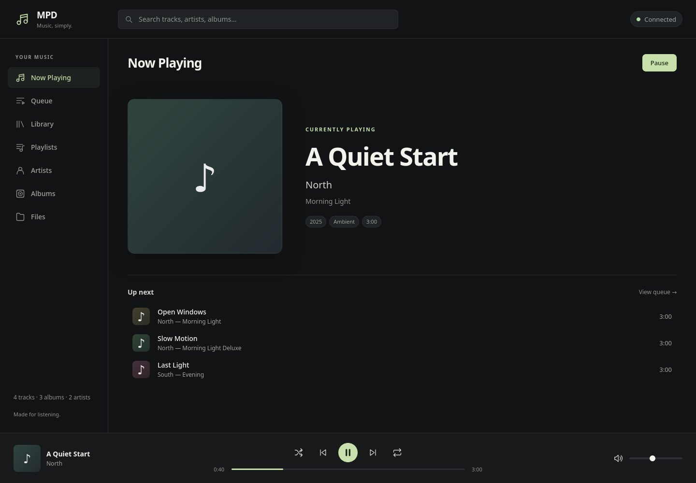
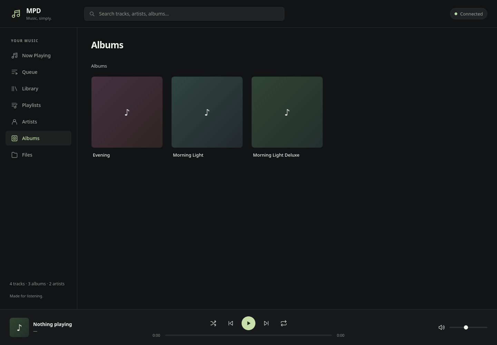

# Music Player for MPD (BETA)

A modern, fully-featured web client for [Music Player Daemon](https://www.musicpd.org/).
Vanilla HTML / CSS / ES modules on the frontend, a tiny Node / Express server bridges
the browser to MPD's TCP protocol.


## Features

- **Real MPD integration** for every view — Queue, Now Playing, Library, Playlists, Artists, Albums, Files
- **Album artwork** fetched from MPD via `readpicture`; stable gradient + note-glyph fallback when none is embedded
- **Search** the whole library from the top bar — typeahead results grouped by Tracks / Artists / Albums
- **Playlist management** — create, rename, delete, save the current queue, load + play
- **Keyboard shortcuts** for every transport action
- **Idle-driven state push** — the server subscribes to MPD's idle subsystem, so changes from other clients (e.g. `mpc next` from a shell) reflect instantly
- **Smooth progress bar** that ticks between state pushes
- **Animations** — view enter, hover lifts, toast slide-in, artwork pulse on track change
- **Toast notifications** for command errors and feedback
- **Auto-reconnect** with exponential backoff

## Screenshots

| Now Playing | Albums |
|-------------|--------|
|  |  |

## Run

```bash
# 1. Install server dependencies
cd server
npm install

# 2. Make sure MPD is running (defaults to localhost:6600)
mpd

# 3. Start the bridge
npm start
# → http://localhost:3000
```

Override defaults with environment variables:

| Variable        | Default      | Description                |
|-----------------|--------------|----------------------------|
| `MPD_HOST`      | `localhost`  | MPD host                   |
| `MPD_PORT`      | `6600`       | MPD port                   |
| `MPD_PASSWORD`  | *(unset)*    | MPD password (if required) |
| `PORT`          | `3000`       | HTTP / WS port             |

## How it talks to MPD

MPD speaks a line-based text protocol on TCP, which browsers can't reach directly.
The Node server connects to MPD with `mpc-js` and exposes:

- `GET /artwork?uri=…` — binary album art (proxies MPD's `readpicture`, cached)
- `WS  /mpd` — JSON command/state stream

```
browser  ──WS──▶  /mpd  ──TCP──▶  MPD :6600
browser  ──HTTP─▶ /artwork  ──▶  MPD :6600
```

## Project layout

```
.
├── public/                       # Static frontend — no build step
│   ├── index.html
│   ├── styles/
│   │   ├── tokens.css            # Design tokens (colors, sizing, type)
│   │   ├── base.css              # Reset + typography
│   │   ├── layout.css            # App shell
│   │   ├── components.css        # Buttons, tracks, transport, album grid, toast, …
│   │   ├── animations.css        # Keyframes + motion tokens
│   │   └── responsive.css        # Narrow-screen adjustments
│   ├── src/
│   │   ├── main.js               # Entry — composes the modules
│   │   ├── dom.js                # $, $$, el(), on(), fmtTime(), debounce()
│   │   ├── mpd.js                # WebSocket client to the MPD bridge
│   │   ├── router.js             # Hash-based view router
│   │   ├── player.js             # Transport, progress, volume, status, footer
│   │   ├── search.js             # Global search with results overlay
│   │   ├── shortcuts.js          # Global keyboard shortcuts
│   │   ├── artwork.js            # Central artwork loader with placeholder fallback
│   │   ├── toast.js              # Toast notifications
│   │   └── views/                # One module per sidebar view
│   │       ├── _shared.js        # trackRow, emptyState, ctx-menu, common helpers
│   │       ├── now-playing.js
│   │       ├── queue.js
│   │       ├── library.js
│   │       ├── playlists.js
│   │       ├── artists.js
│   │       ├── albums.js
│   │       └── files.js
│   └── assets/                   # Icons, artwork
├── server/                       # Express + ws bridge to MPD
│   ├── package.json
│   ├── index.js                  # Serves public/, runs /mpd WS + /artwork
│   └── mpd-bridge.js             # mpc-js wrapper, command handlers, idle loop
├── CHAT_LOG.md                   # Build log of this session
├── README.md
└── .gitignore
```

## State flow

Everything in the UI is a function of one `mpd.subscribe()` callback. The server
broadcasts the current state (`{ playing, track, queue, volume, elapsed, duration, random, repeat, stats }`)
on every change (whether triggered by the UI, by another client, or by an MPD
subsystem change), and each module re-renders the slice it owns.

```
                 ┌──────────────┐
                 │  mpd.subscribe ────▶ player.js → footer + transport
                 │      ▲
   mpc-js   ────▶│ mpd-bridge.js │ ◀──── player.js (commands)
   (TCP)         │      │
                 │      ▼
                 │  WebSocket /mpd ◀──── views/*.js (commands)
                 └──────────────┘
```

## Keyboard shortcuts

| Key            | Action                              |
|----------------|-------------------------------------|
| `Space`        | Play / pause                        |
| `←` `→`        | Previous / next                     |
| `↑` `↓`        | Volume up / down (5% steps)         |
| `M`            | Mute toggle                         |
| `S`            | Shuffle                             |
| `R`            | Repeat (off → all → one)            |
| `/`            | Focus search                        |
| `1`–`7`        | Switch sidebar view                 |
| `Esc`          | Clear search                        |

## Configuration

The server reads these environment variables on boot:

```bash
MPD_HOST=nas.local
MPD_PORT=6600
MPD_PASSWORD=hunter2
PORT=3000
npm start
```

## Contributing

Issues and PRs welcome. The frontend has no build step, so any change to a file
under `public/` is live on refresh. The server uses ES modules, so it works
on Node 18+.

## License

MIT

This project is vibe coded
